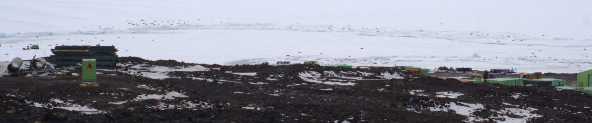
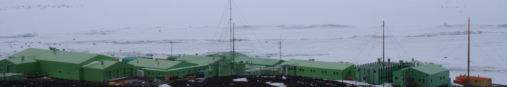
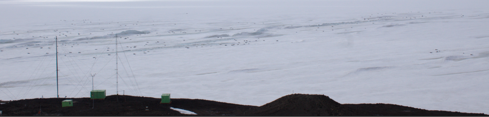
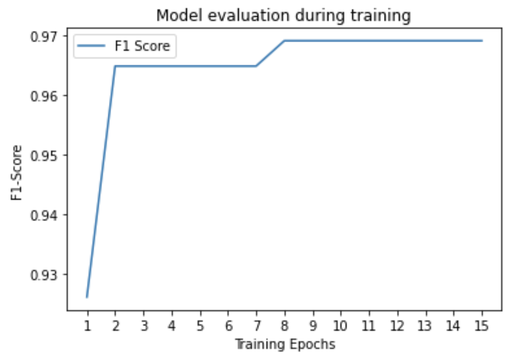
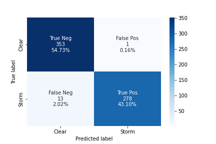

Snowstorm Classification Using ResNet-18 CNN for Seal Monitoring Application
============================================================================

***Abstrast—The reconstruction of Antarctica New Zealand's research centre, namely
  Scott Base, is set place to start construction at the end of 2022.
  Previous research has been conducted to measure the surrounding
  Weddell Seal activity to ensure the population is not disturbed once
  Scott Base's construction is underway. This research paper proposes a
  finetuned ResNet-18 Convolutional Neural Network to classify
  snowstorms in the Seal images taken in the 2019-2020 Summer. The value
  of a reliable and accurate model is in the ability to distinguish
  between true and false low counts of the population (where false
  counts arise from snowstorm induced low-visibility). Evaluation of the
  proposed model shows encouraging results. The model achieves an
  accuracy of 97.8%, precision of 99.6%, recall of 95.5% and a
  F1 Score of 97.5%. These results outperform alternate non-CNN
  weather classification approaches (86%) and match that of other
  ResNet-18 weather classifiers (98.22%).***

**Keywords: ResNet-18, Convolutional Neural Network, Snowstorm, Antarctica, Image
Classification**

**Bibliography:** ./refs.bib

# Introduction

Antarctica New Zealand has secured a \$344 million budget for the
redevelopment of its research station Scott Base. The institute will
start construction in the 2022-2023 Summer. A research project to
monitor the surrounding Weddell Seals is currently being undertaken
throughout 2022 by myself. The project is supervised by Professor
Richard Green and Postdoctoral Researcher Oliver Batchelor. Both Richard
and Oliver are experts in the area of Computer Vision. Monitoring of the
nearby Seal colonies is required to ensure that the groups are minimally
disturbed by the construction noise.

During the analysis of the Seal's counts in the 2019-2020 summer by
Batchelor, the accuracy was affected by severe snowstorms [@Batchelor].
The object detector performed well in moderate snowstorms where the
wind-blown snow added noise to the images. However, heavy snowfall that
impacted the visibility of the high-resolution cameras resulted in a
cluster of counts of zero seals. In some cases, the camera lens is
covered with snow.

Without being able to distinguish if the image is affected by a
snowstorm, the validity of low Seal counts is jeopardised. The result
could be a true low count or a false count due to the low visibility
caused by a snowstorm. The validity of the low counts of the Seals is
crucial if a causational relationship between Scott-Base construction
noise and disturbed seals can be made.

Generally, sensors have been used for weather observation and detection.
However, the installation and maintenance of such sensors are costly.
This cost is amplified when considering Antarctica's environment
justified as off-the-shelf equipment is rarely suited for dramatic
storms.

# Background

Most research in the field of weather classification originates outside
of Antarctica and does not focus on binary classification (e.g. Does the
image contain a snowstorm?). Multi-class weather classification models
are crucial to Internet-of-Things (IoT) and Cyber-Physical-Systems
(CPS). For example, self-driving cars commonly utilise Lidar for their
superior angular resolution and highly accurate range measurements.
However, the sensors are greatly affected by adverse weather conditions
such as snow, fog and rain. Raindrops that fall close to the sensor give
a reading similar to close objects on the road [@Zang]. To compensate,
the system can use a multi-class weather classification model to
identify rain or snow and adjust sensor parameters to better suit the
conditions [@Zang].

Weather classification techniques have had great improvement over the
recent years, a headway that can be partially explained by the
accelerated performance of Convolutional Neural Networks (CNN) [@Gu].
This can be demonstrated by the high levels of accuracy in existing
related work.

## SAID Approach

One approach that forgoes CNN's blends and boosts certain histogram
features in an image to maximise the accuracy of a set of classifier
algorithms. The classification algorithms are Random Forest, KNN, Naive
Bayes and Radial base kernel function Support vector machine (RBF-SVM).
The features optimised are Hue, Saturation and Value (HSV), Contrast,
Gradient and Local Binary Pattern (LBP). The approach utilises an
ensemble of said classifying algorithms which each has accuracy weighted
votes on the weather of the input image. This approach resulted in a 86%
accuracy on an unseen testing dataset [@Gbeminiyi]. The reliance on
accuracy as a sole metric for the success of a pipeline can be viewed as
archaic. The faults with solely using accuracy to quantify the
performance of a classifier are well documented [@Chicco]. Such metric
does not account for the ratio of retrieved documents that are relevant
(precision). The accuracy of the positive class (recall) is also
obfuscated. Alternative classification metrics should be used such as
the F1-score, or the Matthews Correlation Coefficient (MCC) when the
cost of low precision and low recall is unknown [@Chicco].

## CNN Approach

One approach utilises a finetuned CNN to produce outstanding results.
[@Haija] utilises ResNet-18, a 72-layer architecture with 18 deep
layers. The proposed ResNet-18 CNN is pre-trained on the ImageNet
database. This large image database currently holds more than 14 million
hand-annotated images [@Reynolds] containing over twenty thousand
classes. However, training a model on such a significant number of
images with today's technology is not feasible. While the paper fails to
specify, the ResNet CNN will have been trained on a subset of the
database. The ImageNet Large Scale Visual Recognition Challenge (ILSVRC)
is an annual competition held from 2010 to 2017 in which contestants
must classify a one million image ImageNet subset containing one
thousand object classes. This dataset is commonly used to pre-train CNN
models. The proposed ResNet-18 was further finetuned using the
Multi-class Weather Dataset for Image Classification (MWDIC) [@Ajayi].
MWDIC holds 1125 images partitioned into four classes: Sunrise, Shine,
Rain and Cloudy. Researchers split the MWDIC into training and testing
subsets with a 75% and 25% allocation respectively. Sample images of the
four classes in the MWDIC are seen in
Fig. [1](#fig1).

![Sample images of Cloudy, Rain, Shine & Dawn
[@Haija]](images/sample.png)

The model achieves an impressive 98.22% on the testing subset. This
shows an improvement over the previous approach which refrained from
using CNN's. Another improvement from the previous research paper is in
the form of model evaluation. Additional metrics used are the precision
and sensitivity of the classification. The papers also utilised a
Confusion Matrix (Fig. [2](#fig2)) to describe the performance of the multi-class
classification model in terms of the number of False Negatives, False
Positives, True Negatives and True Positives.

![Confusion Matrix from multi-class weather classification model
[@Haija]](images/conf.png)

# Solution

## ResNet-18

Residual neural networks (ResNet) [@He] are effective when training deep
neural networks. Its architecture adds connections between layers to
skip or add shortcuts, namely skip-connections. The two main reasons for
this added complexity are:

1.  Avoids the vanishing gradient problem.

2.  Reduces the severity of Degradation. Due to additional layers
    increasing training error [@He].

Residual Blocks (RB) exist in the ResNet architecture for this purpose.
An RB is a stack of layers organised using the output of an earlier
layer as an input to a deeper layer in the RB. Therefore, creating a
skip-connection by design, shown in Fig. [3](#fig3).

![An example of a skip-connection in the ResNet-18 architecture
[@He]](images/skip.png)

The ResNet-18 architecture can be broken down into four modules each
with four convolutional layers. Additionally, there is a convolutional
layer accepting the input and a fully-connected layer making a total of
eighteen layers. A softmax layer is added to perform classification
tasks. Fig. [4](#fig4) shows the
ResNet-18 architecture along with the skip-connections.

![ResNet-18 Architecture [@Farheen]](images/resnet.png)

The proposed storm classification pipeline can be abstracted into three
components: Preprocessing component, the ResNet-18 finetuning component
and the Classification component. The architecture of the proposed model
is shown in Fig. [5](#fig5). The
pipeline starts by processing images taken from the Antarctic Dataset
Subset (ADS). The preprocessing stage performs five operations to
augment, label, shuffle and partition the images. This stage is
necessary to normalise the Finetuning component's inputs for the
training, validation and testing phases. The ADS and processing stages
are elaborated on in sections [3.2](#ADS) and [3.3](#stages) respectively.

## Antarctic Dataset {#ADS}

The Weddel Seal Abundance Monitoring Programme, carried out by
Antarctica New Zealand, annually monitors the seal population to
evaluate any impact the current Scott Base renovations could have on
seal counts. A time-series sequence of images was taken over the
2018-2019 Summer showing the Weddell seals surrounding Scott Base,
Antarctica. Three DSLR cameras were set up with their viewpoints. The
10-minute interval images were cropped to *5000 x 700* pixels to focus
on the colony [@Batchelor]. Fig. [\[fig6\]](#fig6){reference-type="ref"
reference="fig6"} shows example images of the three viewpoints
surrounding Scott Base.

The 2019 Antarctic Dataset contains a total of 25,275 images split
across the three camera angles. With Camera A, B and C possessing 6980,
9113 and 9182 images respectively. It is not feasible for the ResNet-18
architecture (with an input size of *224 x 224*) to train on such a
large dataset. Additionally, each image must be manually classified as
to whether it contains a snowstorm. It is for these reasons that the
Antarctica Dataset Subset (ADS) was created. The ADS contains a smaller
total count of 894 images split evenly across the three cameras. The
choice to evenly split the dataset across the viewpoints was to avoid an
inaccurate precision-recall curve due to class imbalance [@Williams].

## Image Preprocessing {#stages}

The aim of preprocessing is to prepare the images to be fed into a
neural network. Additionally, augmentations are commonly added to
artificially boost the input dataset and to give the model a wider array
of scenarios to train on. Augmentations can help to generalise a model,
however, due to the static nature of the ADS (fixed size, camera
position, lens), only basic augmentations were applied. For the proposed
ResNet-18 model the following stages are performed on the images:

**Data Partitioning:** This stage splits the ADS into three datasets:
training (70%), validation (15%) and testing (15%). This partition ratio
is recommended for datasets of this size [@Tokuc]. The model in
initially fit to the training dataset to learn the weights of the
network. Next, the semi-trained model is tested on the validation set to
evaluate the immature model and tune its hyperparameters. The final
dataset provides an unbiased evaluation on the final model.

**Random Crops:** Due to the large nature of the ADS images, the images
were unified by cropping them to a *500 x 500* square. The images were
cropped at five random locations in the image. Because a storm's
decrease in visibility is observed in every location of an image, a
random crop would suffice. Having five crops per image also
synthetically increased the ADS size by fivefold from 894 to 4470
images. Fig. [9](#fig7) shows an
example of five square crops using Camera A.

**Random Resize:** This stage ensures that the input image meets the
ResNet-18 input size restriction. The synthetic crops from the previous
stage are resized into a *224 x 224 x 3* matrix. This matrix size fits a
224 pixel square RGB image where the three colour channels are each
separately encoded as a third dimension. The resize is randomly centered
in the image to improve the robustness of the model.

**Random Horizontal Flip:** This stage will randomly flip an image with
a 50% probability. Alike other data augmentations, this improves the
performance and outcome of the model by forming a diverse training
dataset.

**Dataset Shuffling:** Every epoch the dataset is shuffled during
training. This stage tries to avoid overfitting the model and reducing
its variance. For example, by training on the storm before the clear
images, we are not providing a dataset representative of the overall
distribution of data.

## Finetuning

Finetuning an existing pre-trained model on a specific dataset can save
a developer time and can result in better-performing models [@Lalor].
The finetuning component in the proposed pipeline starts with a model
with ResNet-18 weights learnt from the ImageNet dataset.
Fig. [10](#fig8) exhibits
finetuning by learning the parameters for a generalised CNN and then
applying the learnt weights to a specialised CNN (snowstorm
classification. Fig. [10](#fig8)
also illustrates the modification in the output layer, decreasing the
number of classes to two.

![Finetuning from ImageNet trained model. Figure adapted from
[@Vogado]](images/finetune.png)

The pre-trained model is then fine-tuned on the ADS to classify
snowstorms. During training, the loss (calculated by the Cross-Entropy
Loss Function) decreases as the optimisation function modifies the
weights and their bias. As mentioned, the Cross-Entropy Loss Function is
used to evaluate the model after each epoch. The Cross-Entropy Loss
Function is defined as: 
$$
    L = -\frac{1}{N}\left [ \sum_{j=1}^{N} \left [ t_{j}log(p_{j})+(1-t_{j})log(1-p_{j}) \right ] \right ]
    $$

Where $N$ is the number of classes, $t_{i}$ is the truth value (either $1$ or
$0$) and $p_{i}$ is the Softmax probability for the $i$th class.

The optimisation function used was stochastic gradient descent (SGD)
with momentum. The popular momentum method was included to aid
convergence time. Momentum works by remembering the previous change in
weight and using its magnitude to accelerate towards convergence. The
formula for SGD with momentum is defined as:
$$
    \begin{split}
        \Delta w_{t+1} &:=  \mu \Delta w_{t} - \alpha g_{t+1}L \\
        w_{t+1} &:= w_{t}+\Delta w_{t+1}
    \end{split}$$
Where $w$ is the weight, $\mu$ is the momentum
(between $0$ and $1$), $\alpha$ is the learning rate, $g$ is the
gradient and $L$ is the loss function given by
eq. ([\[loss\]](#loss)). In this
paper, $\alpha = 0.001$ and $\mu = 0.9$.

## Classification

Last in the pipeline is determining which class is best represented by
the ResNet-18 output. The results from the final ResNet-18 layer are
average-pooled and flattened into a *2 x 1* matrix. Due to the nature of
a binary classification task, the Softmax function effectively
calculates the probability of the image being a snowstorm. The Softmax
function is defined as:
$$
    \sigma(z_i) = \frac{e^{z_{i}}}{\sum_{j=1}^N e^{z_{j}}} \ \ \ for\ i=1,2,\dots,N
$$
Where $N$ is the number of classes.

## Ensemble Classification

All the aforementioned techniques have been concerning classifying
snowstorms in small *224 x 224* images. Inaccurate classifications can
occur if a single crop is used to classify the original *5000 x 700*
image. To overcome this, an ensemble of classifications is conducted on
the original image, using and ensemble of methods provides a better
performing classifier [@Polikar]. Akin to the preprocessing stage, the
image is cropped five times in random locations. The model classifies
each of the five images and combined accuracy is calculated.
eq. ([\[acc\]](#acc)) defines the
method for combining the accuracies of the classifications.
$$
    \begin{split}
        a_{j} &:= 
        \begin{cases}
            a_{j},& \text{if Storm}\\
            -a_{j},& \text{if Clear}
        \end{cases}\\
        a_{combined} &:= \frac{\sum_{j=1}^{E}a_{j}}{E}
    \end{split}
$$
Where $a$ is accuracy and $E$ is the number of crops
(five in this case). eq. ([\[class\]](#class)) shows how the final classification is chosen where $C$ is the predicted class. Accuracies can be both positive (Storm) and
negative (Clear).

$$
    C :=
    \begin{cases}
        Storm,& \text{if $a_{j} \geq$ 0}\\
        Clear,& \text{if $a_{j} <$ 0}
    \end{cases}
    $$

# Results

Tab. [1](#tab:details)
illustrates a summary of the development environment itself and its
configurations when training the ResNet-18 model.

| **Item**      | **Description**               |
|---------------|-------------------------------|
| OS            | Linux Mint 20.3               |
| CPU           | Intel Core i7-8700 @ 3.20GHz  |
| GPU           | Nvidia GeForce RTX 2070       |
| IDE           | JetBrains Gateway Beta 2022.1 |
| Language      | Python 3.8.10                 |
| Camera        | Panasonic Lumix DC-S1R (47MP) |
| Model         | ResNet-18                     |
| Loss Function | Cross-Entropy                 |
| Optimiser     | Stochastic Gradient Descent   |
| Epochs        | 15                            |
| Batch Size    | 8                             |
| Learning Rate | 0.001                         |
| Momentum      | 0.9                           |

To quantify the model's performance, four well-known metrics have been
used. Namely, accuracy, precision, recall and F1-score. Each metric is
briefly described below with True Positive, True Negative, False
Positive and False Negative respectively abbreviated to TP, TN, FP and
FN:

**Accuracy:** The ratio of the number of correct classifications to the
total number of classifications.
$$
    accuracy = \frac{TP + TN}{FP + FN}
$$
**Precision:** The number of correct snowstorm classifications to the total number of snowstorms
seen.
$$
    precision = \frac{TP}{TP + FP}
$$
**Recall:** The number of correct
snowstorm classifications to the total number of snowstorms classified.

$$
   recall = \frac{TP}{TP + FN}
$$
**F1-Score:** A measure of the
classification's accuracy when accounting for the models precision and
recall. 
$$
    F_{1}Score = 2 \times \frac{recall \times precision}{recall + precision}$$

To measure the model's performance during training, the loss and the
F1-score were calculated. The loss function --- defined by
eq. [\[loss\]](#loss) --- showed
improvement in the model as the pre-trained model has a loss of $0.3004$
and the final fine-tuned model has a loss of $0.0774$. A history of the
best F~1~-Score --- defined by eq. [\[f1\]](#f1){reference-type="ref"
reference="f1"} --- was also tracked during the 15 epochs.
Fig. [11](#fig9) shows the
progression of the model starting at $F_{1} = 0.926$ and finishing at
$F_{1} =  0.9692$.

The performance of the proposed model can be illustrated by a confusion
matrix. This shows the distribution of the True Positive, True Negative,
False Positive and False Negatives.
Fig. [12](#fig10) illustrates
the final snowstorm classifiers confusion matrix.

Digesting Fig. [12](#fig10), the
proposed model performs excellent with $< 2.5\%$ of images being
incorrectly classified. The proposed model is quantifiably evaluated
below using the aforementioned metrics.

$$\begin{aligned}
\boldsymbol{accuracy}&\boldsymbol{=97.8\%}  &  \boldsymbol{precision} &\boldsymbol{=99.6\%}  \\
\boldsymbol{recall}&\boldsymbol{=95.5\%}  &  \boldsymbol{F_{1}Score} &\boldsymbol{=97.5\%} \end{aligned}$$

The proposed model offers a reliable snowstorm classifier with high
accuracy in the trained environment. Other metrics --- namely the
$F_{1}Score$ at 97.5% --- back this claim with their encouraging
results. However, the praises of the proposed model cannot be celebrated
without considering its limitations of such. The model has only been
trained and tested on a relatively narrow dataset (ADS). This can
restrict the performance of the model in environments that even slightly
differ to that of Cameras A, B & C. Fortunately, this was foreseen and
can be treated as a non-issue due to the application of the model
aligning (down to the viewpoint) with the trained dataset. It is
therefore noted, as a constraint and warning, that the proposed model is
not generalised but specialises in classifying snowstorms in the three
cameras surrounding Scott Base.

# Conclusion

Antarctica New Zealand's Scott Base redevelopment is set to start after
the planning and design are finalised at the end of 2022. Previous
research, conducted by Oliver Batchelor [@Batchelor], commenced
monitoring of nearby Weddell Seal colonies to ensure the population is
not disturbed. This research paper proposed a ResNet-18 CNN to classify
snowstorms in the Seal images taken in the 2019-2020 Summer. A reliable
and accurate model empowers researchers to distinguish between true and
false low counts of the population (where false counts arise from
snowstorm induced low-visibility).

The final CNN model was finetuned from an ImageNet pre-trained model to
save time and increase performance. Specifically, the model was
finetuned using a subset of previously captured images from Antarctica.
This dataset was chosen for its near-identical viewpoints to its
application. A random $70\%$, $15\%$, $15\%$ partition was applied to
split the images into training, validation and testing data loaders
respectively. Finally, the proposed model shows encouraging results in
comparison to existing weather classification research. The accuracy of
the proposed model ($97.8\%$) outperforms the SAID ensemble approach
[@Gbeminiyi] ($86\%$) by 12.84% while it falls short by only $0.429\%$
of an alternative ResNet-18 weather classification CNN [@Haija]
($98.22\%$).

# Appendix

## Source code

The Jupyter Notebook containing the image preprocessing, finetuning and
classification stages are hosted online at
<https://github.com/fletcherd3/Antarctic-Snowstorm-Classification/blob/master/storm_detection.ipynb>.

## Dataset

The random cropped images created from the Jupyter Notebook are
organised into their classes (Storm & Clear) and the datasets (train,
validation & testing). The images are hosted online at
<https://github.com/fletcherd3/Antarctic-Snowstorm-Classification/tree/master/data>.
